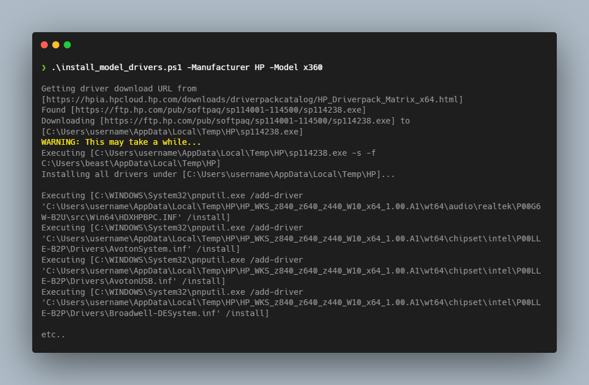

# Install Model Drivers

[](https://github.com/PowerShell/PowerShell)
[](https://github.com/TsekNet/PowerShell/blob/master/LICENSE)

TL;DR: Downloads and installs Windows drivers directly from Manufacturer websites.

This script is meant to be invoked during Windows Operating System Deployment
to install drivers from common Hardware Manufacturers such as Lenovo, Dell,
HP, etc. This script *can* also be used to update drivers of live systems,
but may lead to system instability caused by replacing storage, network,
display, etc. drivers.

## Installation

Deploy this script however you would normally deploy scripts to systems that are
automatically deployed in your environment via MDT, AutoPilot, Glazier, etc.

## Usage

This script accepts two parameters: `Manufacturer` and `Model`. That's all you
need to *the latest* drivers directly from the Manufacturer's website.

### Lenovo

Downloads Lenovo driver installer matching the regex `20y0` exact string to
  `$env:TEMP\Lenovo` then installs the drivers from the expanded installer.

```powershell
.\install_model_drivers.ps1 -Manufacturer Lenovo -Model 20y0
```

### HP

Downloads HP driver installer matching the regex `Z440` exact string to
  `$env:TEMP\HP` then installs the drivers from the expanded installer.

```powershell
.\install_model_drivers.ps1 -Manufacturer HP -Model Z440
```

### Dell

Downloads Dell driver installer matching the regex `9380` exact string to
`$env:TEMP\Dell` then installs the drivers from the expanded installer.

```powershell
.\install_model_drivers.ps1 -Manufacturer Dell -Model 9380
```

## Screenshots



## Contributing

Pull requests are welcome. For major changes, please open an issue first to
discuss what you would like to change.

Please make sure to update tests as appropriate.
