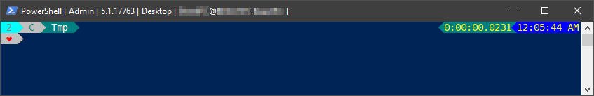
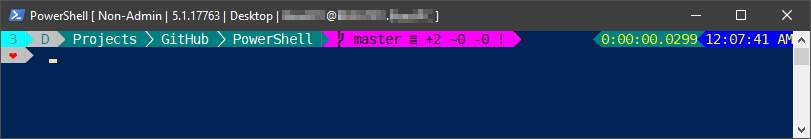

# TsekNet's Profile

Please see below my heavily customized PowerShell profile. Feel free to use and distrubute it as
you see fit. I am always improving this, so if you catch any errors, or see where I
can improve, please let me know!

To use this profile, simply place this file in any of your $profile
directories and restart your PowerShell console
(Ex: $profile.CurrentUserAllHosts)

## Screenshots

PowerShell running in an administrative window while working in C:\tmp



PowerShell running in a non-admin window while working on a git repo



## Getting Started

These instructions will get you a copy of the project up and running on your local machine for development and testing purposes. See deployment for notes on how to deploy the project on a live system.

### Prerequisites

The following modules are required:

```powershell {.good}
posh-git
oh-my-posh
Get-ChildItemColor
```

### Installation

1. Copy the following into a PowerShell prompt:

```powershell
Invoke-WebRequest -Uri 'https://raw.githubusercontent.com/tseknet/PowerShell/master/Profile/Profile.ps1' -OutFile $profile.CurrentUserAllHosts -TimeoutSec 30
```

2. Restart PowerShell (or run ```powershell & $profile.CurrentUserAllHosts```)

*NOTE* If you run into any errors, $Error[0] will have the latest error
message for troubleshooting.

## Contributing

Feel free to submit a pull request if you see any issues.

## License

This project is licensed under the MIT License - see the [LICENSE](../LICENSE) file for details.

## Acknowledgments

* Hat tip to anyone whose code was used
* etc
