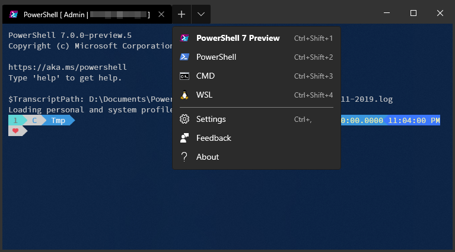

# TsekNet's Terminal

My personal, heavily customized [Windows Terminal profile](https://github.com/microsoft/terminal/blob/master/doc/user-docs/UsingJsonSettings.md).



## Installation

Execute the following command in a PowerShell prompt:

```powershell
Invoke-WebRequest -Uri 'https://raw.githubusercontent.com/tseknet/PowerShell/master/Profile/Profile.ps1' -OutFile "$env:LOCALAPPDATA\Packages\Microsoft.WindowsTerminal_8wekyb3d8bbwe\LocalState\profiles.json"
```

## What's included

The Windows Terminal profiles come pre-configured:

1. PowerShell 7 Preview
2. PowerShell 5
3. CMD
4. WSL

## Contributing

Please open a pull request with any issues you run into.

## License

This project is licensed under the MIT License - see the [LICENSE](../LICENSE) file for details.

## Acknowledgments

* Hat tip to anyone whose code was used
* etc
